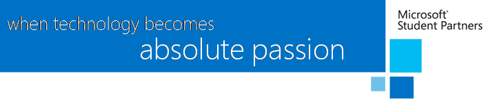

**Bienvenido al programa Microsoft Student Partner**
====================================================

¡Enhorabuena! Has sido seleccionado como Microsoft Student Partner y estamos encantados de poder contar contigo durante el año 2015-2016. 

Cada día, en más de 110 países en todo el mundo, miles de MSPs comparten su conocimiento y pasión por la tecnología con sus compañeros, adquiriendo habilidades de liderazgo y comunicación, así como experiencia técnica.  

Ser MSP te coloca en una posición privilegiada y en primera línea para conocer antes que nadie todas las novedades de las tecnologías más recientes (o las que aún están a punto de salir…), y te convierte en la persona a la que otros estudiantes recurren para obtener respuestas y conocer las nuevas tendencias de Microsoft. Esta guía de iniciación pone a tu disposición la información que necesitas para aprovechar al máximo tu tiempo como MSP. 

Beneficios del programa MSP
---------------------------

Como MSP dispones de beneficios que ponemos a tu disposición para que puedas sacar el máximo partido de esta experiencia. Algunas de estas ventajas son:

-   Suscripción MSDN (Microsoft Developer Network) valorada en unos 7900€ y gracias a la cual tendrás acceso a casi todo el software de Microsoft, del que nos gusta destacar:

-   Visual Studio Online: herramienta online que te permite crear repositorio de código privados ilimitados, realizar control de versiones, trabajo en equipo, gestión de proyectos con metodologías ágiles…

-   Azure: suscripción con 130€ de crédito para que gastes cada mes en tus proyectos en la plataforma de cloud computing de Microsoft.

-   Cuenta de desarrollador para la Windows Store: creación gratuita de tu cuenta de publicador para poder subir aplicaciones a la Store de Windows.

-   Visual Studio Enterprise: entorno de desarrollo para proyectos de aplicaciones móviles (Windows, Android, iOS), aplicaciones web, servicios en el cloud, soluciones de IoT, videojuegos…

-   Versiones finales y preview de determinados productos, como el sistema operativo Windows o la suite de programas de Office

-   Licencia de Office 365 con tu cuenta \@studentpartner.com, incluyendo Exchange Online, Skype for Business y aplicaciones Office para varios dispositivos de las principales plataformas

-   Microsoft Imagine: portal donde poder obtener servicios de Microsoft de manera gratuita para estudiantes y MSP

-   Certificados de pertenencia al programa: certificados oficiales como miembro del programa MSP, de cara a mejorar tu CV

-   Posibilidades de trabajo en Microsoft y su red de partners: al entrar en la familia de los MSPs, y sobre todo en la dinámica de asistir a eventos y formaciones, tendrás contacto directo con gente que trabaja en Microsoft o en muchas de las empresas de su red de partners. También os comunicamos ofertas de trabajo en el grupo de los MSPs antes de distribuirlas públicamente. Esto te coloca de nuevo en una posición privilegiada a la hora de aplicar a cualquier posición que se abra tanto en Microsoft como en algunos de sus partners

-   Becas en Microsoft: de igual manera que en el punto anterior, el pertenecer al programa MSP te da prioridad en el proceso de selección de las becas técnicas en Microsoft

-   MSP Buddie: a cada MSP nuevo se le asigna un buddie, o MSP que lleve más tiempo en el programa, para que le ayude a dar sus primeros pasos en el
    programa y le oriente a la hora de organizar eventos, participar en cualquier actividad, o simplemente le explique cómo aprovechar el máximo del programa

-   Mentorship por parte de [MVPs](https://mvp.microsoft.com/) y empleados de Microsoft: programa destinado a que cada MSP tenga un mentor experto en alguna tecnología que le pueda asesorar, tanto a mejorar técnicamente como a incorporarse al mercado laboral

-   Formación exclusiva impartida por parte de Microsoft y expertos del sector: a lo largo de tu permanencia en el programa recibirás formación creada a medida para vosotros según las novedades tecnológicas que vayan surgiendo y lo que nos vayas proponiendo

-   Formación online: Además también cuentas con la plataforma de formación [Microsoft Virtual Academy](http://www.microsoftvirtualacademy.com/). En la que podrás aprender sobre todo tipo de tecnologías, así como realizar un seguimiento personalizado de tu aprendizaje.

-   Acceso gratuito a eventos nacionales e internacionales: Microsoft realiza a lo largo del año muchos eventos para desarrolladores y profesionales de IT, y los estudiantes dentro del programa MSP suelen recibir descuentos o entradas gratuitas

¿Quiénes somos?
---------------

Detrás de todo el programa, está todo el equipo del departamento de Developer Experience (DX) de Microsoft, y como una imagen vale más que mil palabras, aquí puedes ponernos cara: <http://aka.ms/dxspainteam>

Ya sabes, si tienes cualquier pregunta, duda, problema o simplemente tienes algo que contarnos, no dudes en ponerte en contacto con nosotros y estaremos encantados de ayudarte.

Además del equipo de Microsoft, lo más importante del programa sois vosotros, los Microsoft Student Partners, estudiantes apasionados por la tecnología, activos en las comunidades de Microsoft y que les gusta aprender y descubrir nuevas tecnologías junto a nosotros. Puedes conocer a algunos de tus [compañeros MSPs](http://aka.ms/mspspainlist) y ver algunos de [sus proyectos](http://aka.ms/mspspainprojects) para inspirarte…¡e ir pensando en los tuyos!

¿Qué esperamos de tí?
---------------------

Permanecer activo y comprometido como MSP es muy importante de cara a poder aprovechar todas las ventajas de este programa. Por lo que esperamos que
seas una persona proactiva, que te involucres en las actividades que se organicen como formaciones y eventos, y que realices seguimientos mensuales con los MSP Lead locales.

Además, te recomendamos que te establezcas unos objetivos a cumplir durante el año. Entre tus objetivos deberías incluir:

-   Dar sesiones a otros MSP. Consideramos que un gran pilar del programa MSP es estar en contacto con la comunidad, y una buena manera de ello es compartir con otros estudiantes las actividades que te gusta hacer.

-   Ayudar a mantener activo el club .NET de tu universidad organizando e impartiendo sesiones técnicas. Si tu universidad todavía no tiene club, te asesoraremos sobre cómo puedes crear uno.

-   Como cada MSP tiene su propio blog, sería recomendable tener cierta actividad en él. Aproximadamente un post al mes es lo recomendado. El tema de los post es totalmente libre, pero se recomienda que sean sobre tecnología en el que aproveches para ir contando las cosas que vas aprendiendo

-   Crear un portfolio con los proyectos que vayas realizando, ya sean apps, webs, pequeños ejemplos de código publicados en Github…todo esto ayudará a
    conseguir mayor visibilidad de tu trabajo.

-   Ser activo en las redes sociales (Facebook, Twitter, LinkedIn)

Participación en eventos y concursos
------------------------------------

Existen multitud de iniciativas y concursos de los que puedes formar parte, aunque como MSP te animamos a que vayas un paso más allá, y seas tú el que organice y promueva estas actividades en tu comunidad.

Con la finalidad de ayudarte a planificar tus actividades puedes acceder a [esta página](http://aka.ms/msspainevents) donde encontrarás los eventos que se van a realizar.

A continuación, te detallamos algunas de las iniciativas globales en las que puedes participar como parte de la experiencia internacional que supone pertenecer al programa MSP:

**Imagine Cup**

[Imagine Cup es la mayor competición internacional para estudiantes en desarrollo de proyectos tecnológicos](https://www.imaginecup.com/), con premios en metálico de hasta \$50.000. En el programa Imagine Cup, los participantes tendrán que crear sus equipos, desarrollar un proyecto e ir superando las eliminatorias de camino a la gran final.

Puedes ver [toda la información relativa a la competición en este enlace, así como algunos de los proyectos destacados de la última edición](http://blogs.msdn.com/b/esmsdn/archive/2015/09/24/161-bienvenido-a-imagine-cup-2016.aspx).

**Inciativas de Learn to Code**

Las iniciativas de *Learn to code* buscan inspirar a las nuevas generaciones de desarrolladores. La participación en estos eventos por parte de los MSPs estará coordinada por el MSP Lead local. Para ayudarte con la preparación del evento *Learn to code* ponemos a tu disposición los siguientes recursos:

-   Un [curso en MVA diseñado para usarse en los eventos Hour of Code](https://www.microsoftvirtualacademy.com/en-us/training-courses/hour-of-code-with-touchdevelop-8401)*,* pero que también puede realizarse de forma independiente. Este curso ha tenido mucho éxito con estudiantes de más de 9 años, incluso con adultos.

-   Un [curso de formación de formadores que se van a encargar de gestionar el evento Hour of Code](http://aka.ms/HoCEventTraining).

-   [Materiales para extender el evento Hour of Code durante cinco o más horas extras de aprendizaje](https://www.microsoftvirtualacademy.com/en-US/training-courses/dream-it-make-it--a-classroom-extension-for-hour-of-code-with-touchdevelop-9070). Estos materiales los usan profesores en sus clases y en actividades extra escolares.

**Hello Cloud Imagine Cup**

Hello Cloud es una [nueva competición dentro de Imagine cup](https://www.imaginecup.com/category/index/6) para todo tipo de estudiantes, que consiste en crear tu propio proyecto orientado a cloud computing. Es una categoría online por la cual puedes ganar premios cada mes. Esta categoría es una forma sencilla de iniciarse.

**MSP Social Insiders Program**

El programa Social Insiders engloba a todos los líderes MSP dentro de su comunidad técnica. Todos los integrantes del programa son estudiantes muy activos que comparten su experiencia y llevan el sus conocimientos y habilidades comunicativas a un nivel superior.

Son pioneros en nuevas tecnologías y mueven todo tipo de eventos en sus respectivos países. Por ser un MSP Social Insider, Microsoft te da acceso a formaciones y eventos exclusivos y puedes optar a acudir a la final de Imagine Cup con los gastos pagados.

Para poder acceder al programa Social Insiders tan solo tienes que ser un MSP muy activo, ir reportando las actividades que vayas realizando, aprender y comunicar los conocimientos que hayas aprendido y por supuesto apuntarte a todos los eventos que quieras.

Puedes conocer a uno de nuestros Social Insiders y su experiencia en el Summit de MSP mundial: <http://blogs.msdn.com/b/esmsdn/archive/2015/09/03/post-invitado-world-msp-summit-and-imagine-cup-2015.aspx>

¿Por dónde empiezo en mis primeros días?
----------------------------------------

Los primeros pasos que te recomendamos para empezar tu camino como MSP son:

-   Activa tu cuenta MSDN: recibirás un enlace para activarlo o bien un códigopara usarlo en el portal de MSDN.

-   Solicita acceso al grupo de Facebook de [España](https://www.facebook.com/groups/MicrosoftStudentPartnersSpain/) y
    [mundial](https://www.facebook.com/groups/MSFTStudentPartners/), y preséntate al resto.

-   Crea tu web/blog que se convertirá en tu portfolio utilizando tu cuentagratuita de Azure para crear el blog. [Tan solo tienes que seguir el paso a paso que hemos creado para ti](https://github.com/esmsdn/Microsoft-Student-Partner-Spain/blob/master/Retos/Reto%201%20Crea%20tu%20portfolio%20-%20Guia%20paso%20a%20paso.docx).

-   Solicita un buddy y un mentor (MSP, MSP Alumni, MVP…) escribiendo a <esdpeestudiantes@microsoft.com>

-   Crea tu perfil en distintas redes sociales: 
    * [Twitter](https://twitter.com),
    * [LinkedIn](https://linkedin.com),
    * [StackOverflow](http://stackoverflow.com/),
    * [MSDN](https://msdn.microsoft.com),
    * [Technet](https://technet.microsoft.com)…

-   Sigue las cuentas de [MSDN](http://www.twitter.com/msdev_es) y de [Technet](http://www.twitter.com/TechNet_es) para estar al día de todo lo
    que hacemos

-   Puedes seguir las cuentas de los evangelistas para conocerles mejor y poder hablar con ellos:
    * **Ester de Nicolás:** [\@esterdenicolas](https://twitter.com/esterdenicolas)
    * **Alejandro Campos:** [\@alejacma](https://twitter.com/alejacma)
    * **Diego Martínez:** [\@diegomrtnzg](https://twitter.com/diegomrtnzg)
    * **Gorka Madariaga:** [\@Gk\_8](https://twitter.com/Gk_8)
    * **Isabel Cabezas:** [\@isabelcabezasm](https://twitter.com/isabelcabezasm)
    * **Javier Gómez:** [\@javierglozano](https://twitter.com/javierglozano)
    * **Juan Manuel Servera:** [\@jmservera](https://twitter.com/jmservera)

-   Completa uno de los cursos de Microsoft Virtual Academy propuestos:

    -   [Programming in C\# Jump Start](http://www.microsoftvirtualacademy.com/training-courses/developer-training-with-programming-in-c)

    -   [Introduction to ASP.NET 5](https://www.microsoftvirtualacademy.com/en-US/training-courses/introduction-to-asp-net-5-13786?l=PvSZtxoXB_5101937557)

    -   [Azure Fundamentals Overview](https://www.microsoftvirtualacademy.com/en-US/training-courses/microsoft-azure-fundamentals-8391)

    -   [Azure Fundamentals: Websites](https://www.microsoftvirtualacademy.com/en-US/training-courses/microsoft-azure-fundamentals-websites-8460)

    -   [Azure Fundamentals: Virtual Machines](http://www.microsoftvirtualacademy.com/training-courses/microsoft-azure-fundamentals-virtual-machines)

    -   [Azure Fundamentals: Storage and Data](https://www.microsoftvirtualacademy.com/en-US/training-courses/microsoft-azure-fundamentals-storage-and-data-8456)

    -   [Fundamentals of Visual Studio Online](https://www.microsoftvirtualacademy.com/en-US/training-courses/fundamentals-of-visual-studio-online-8430)

    -   [A developers Guide to Windows 10](http://www.microsoftvirtualacademy.com/training-courses/a-developers-guide-to-windows-10)

    -   Bonus track: [Windows 10 development for absolute beginners](https://channel9.msdn.com/Series/Windows-10-development-for-absolute-beginners)
        en Channel9

Si tienes cualquier consulta contacta con nosotros a través de nuestro alias de estudiantes <espdeestudiantes@microsoft.com>

De parte de todo el equipo de DX, enhorabuena y ¡bienvenido!

